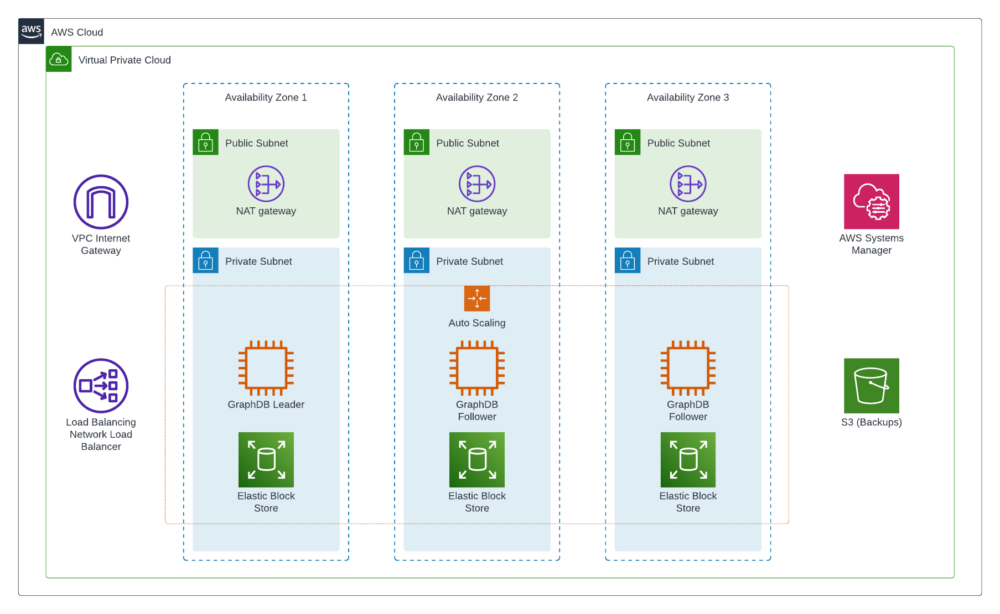

# Architecture Diagram

The GraphDB architecture diagram showcases the deployment architecture for GraphDB on EC2 instances in AWS cloud platform.

The diagram illustrates the key components, and their interactions to provide a high-level understanding of the system's architecture.

[//]: # ([https://lucid.app/lucidchart/ae36aed1-c74f-47e6-83e1-377639115474/edit?invitationId=inv_95649240-827e-4ab4-a6b2-902dcb5c388a&referringApp=slack&page=e4n1U8q9M.QU#]&#40;https://lucid.app/lucidchart/ae36aed1-c74f-47e6-83e1-377639115474/edit?invitationId=inv_95649240-827e-4ab4-a6b2-902dcb5c388a&referringApp=slack&page=e4n1U8q9M.QU#&#41;)

