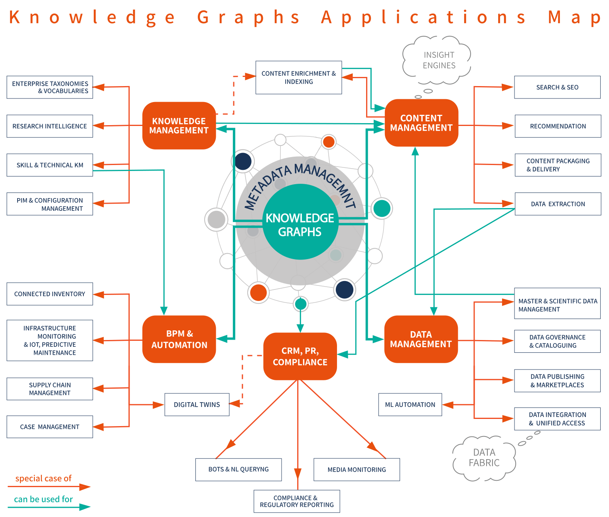

# Use Cases

GraphDB is a semantic graph database, it serves as a versatile tool across multiple industries and use cases.
Its adaptability, scalability and ability to navigate complex relationships empower organizations
to extract insights and unlock the value of interconnected data across domains.
Its wide-ranging applications highlight its role as a transformative force, bridging the gap between data and actionable knowledge.

## Main Applications

### Content Management
If you are a content-centric enterprise, knowledge graphs can help you better utilize and repackage your content. 
By enriching your content with additional metadata, you can make it easier to discover and explore, generate better
feeds, improve user engagement on your website, suggest better recommendations and more. 
Content enrichment can be automated by the use of text analysis.

See also: [What is text analysis?](https://www.ontotext.com/knowledgehub/fundamentals/text-analysis/), 
[Text Analysis for Content Management](https://www.ontotext.com/solutions/text-analysis-for-content-management/), 
[Media & Publishing](https://www.ontotext.com/solutions/media-and-publishing/).

### Knowledge Management
Having the right knowledge about your products, devices, technical documentation, skills and competencies, research 
teams performance, etc. is crucial for many processes within an organization. 
By developing domain-specific taxonomies and vocabularies to populate the semantic model of a knowledge graph, 
you can better classify your documents and thus improve your knowledge discovery and analytics.

See also: [Building Semantic Knowledge Organization Systems with Graphite and GraphDB](https://www.ontotext.com/blog/building-semantic-kos-with-graphite-and-graphdb/), 
[Turning a Taxonomy into a Recommendation Engine](https://www.ontotext.com/knowledgehub/webinars/taxonomy-to-recommendation-engine/).

### Data Management
If you are a data-centric organization, knowledge graphs can enable you to have unified access to lots of diverse data. 
Using big volumes of domain knowledge about companies, electrical networks, pharmacology, scientific publications, etc. 
can help you get deeper analytics, enhance your decision-making, improve your search and recommendation, 
strengthen scientific collaboration and more.

See also: [Healthcare and Life Sciences](https://www.ontotext.com/solutions/healthcare-and-life-sciences/), 
[Financial Services](https://www.ontotext.com/solutions/healthcare-and-life-sciences/), 
[Industry](https://www.ontotext.com/solutions/industry/), 
[Public Sector](https://www.ontotext.com/solutions/public-sector/).

### Business Process Management (BPM) & Automation
Knowledge graphs can help your enterprise get a global view over an extensive set of products or components that work 
together in a complex system such as Building Automation Systems, automotive manufacturing, aerospace, etc. 
They can significantly facilitate infrastructure monitoring, predictive maintenance, research and repurposing of 
existing resources (connected inventory), supply chain management and more.

See also: [Connected Inventory](https://www.ontotext.com/solutions/connected-inventory/), 
[Smart Buildings Are Built of Smart Data: Knowledge Graphs for Building Automation Systems](https://www.ontotext.com/blog/knowledge-graphs-for-building-automation-systems/),
[Industry](https://www.ontotext.com/solutions/industry/).

### CRM, PR, Compliance
Knowledge graphs in combination with text analysis can enable your organization to do better media monitoring for PR 
and reputation management, market research, brand or product perception, competitor analysis, as part of 
know-your-customer and anti-money laundering policies, etc. 
They can also help you with regulatory reporting, digital twins, chatbots and more.

See also: [Better Trade Surveillance by Using Ontotext’s GraphDB to Tackle Market Manipulation](https://www.ontotext.com/knowledgehub/case-studies/better-trade-surveillance-with-ontotext-graphdb/),
[Advanced Drug Safety](https://www.ontotext.com/solutions/advanced-drug-safety/).

